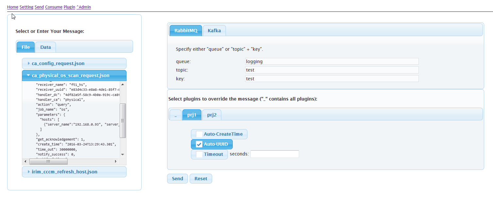
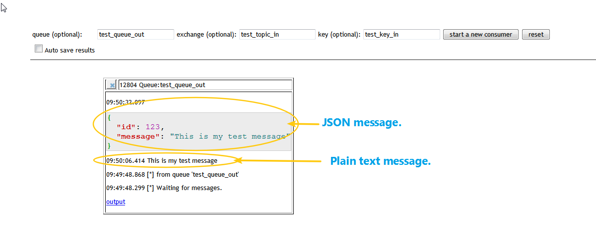
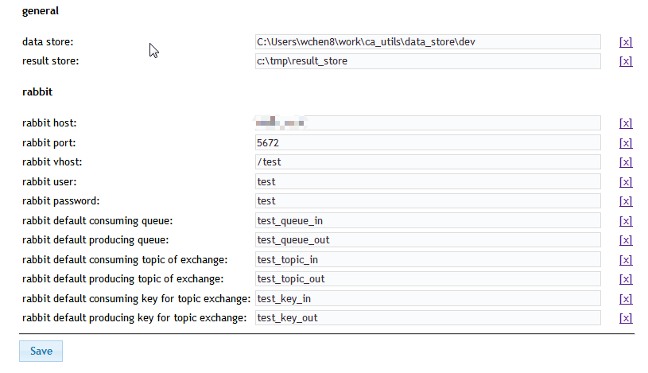
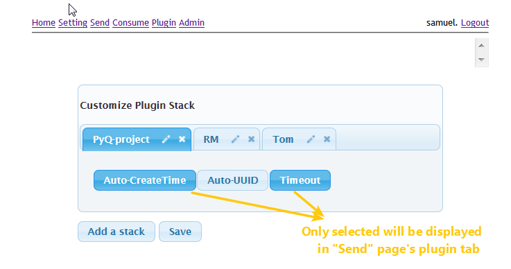

# PyQueuer

PyQueuer is a tool for automatically sending/receiving message to/from MQ.

You may use it either in development for MQ sender/receiver simulation or in test for automation.

[Fork me on GitHub](https://github.com/samuelchen/pyqueuer)

### Features:

* Sending a message to different MQ brokers.
* Supporting plugin to override sending message (e.g. to automatically update the time for a message in fixed file.).
* Support to group some plugins in a stack to avoid too many plugins listed out.
* Choose/type-in Queue, Topic, Key in GUI to send to.
* Sending message from a selected file.
* List all your file message with preview.
* Enter/paste your message to send.
* Select different MQ types.
* Receiving message from different brokers of different MQ.
* Support up to 5 consumers same time to different brokers.
* Choose/type-in Queue, Topic, Key in GUI to receive from.
* Automatically consume new message.
* Automatically save received message to file you specified.
* Settings by account to customize your MQ configurations and others.
* Supports setting groups to face different servers (TODO: planned)

### Pictures

### Tutorial

* Setting
* [Send a message](docs/send.md)
* Receive messages
* Customize plugin Stack

### Supported MQ:

* RabbitMQ
* Kafka

### Use cases

* [Case 1](docs/case1.md)
