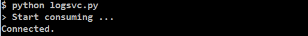
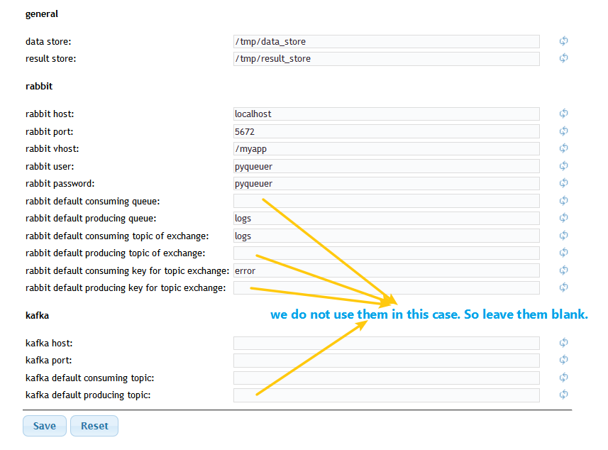
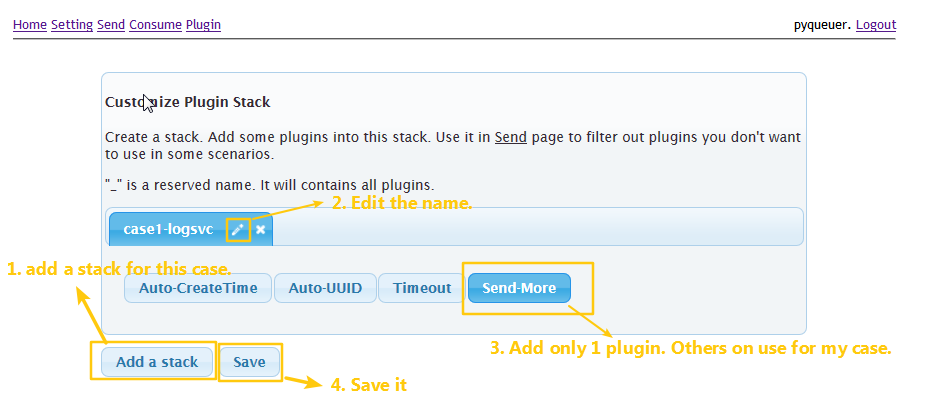
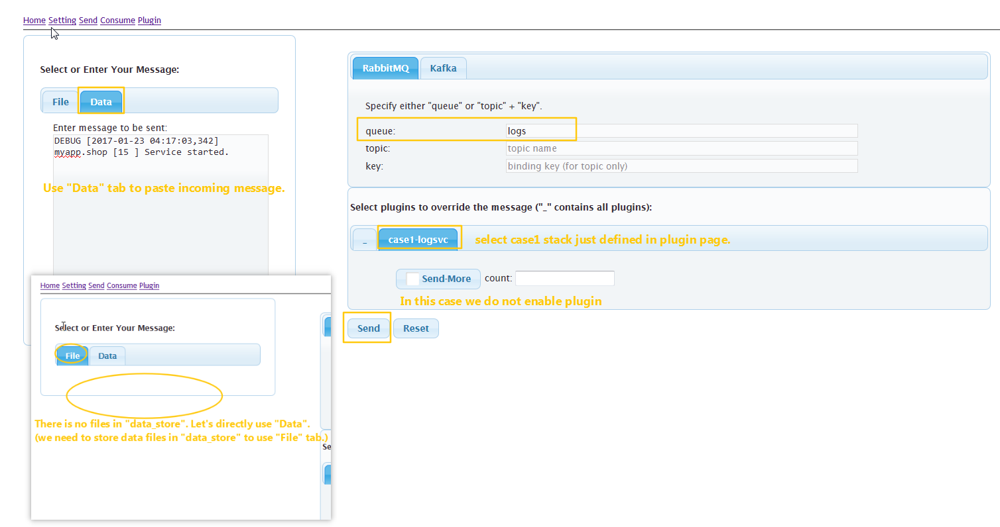
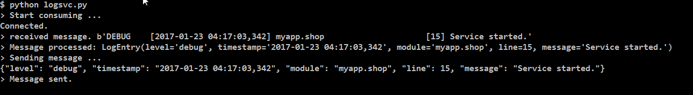
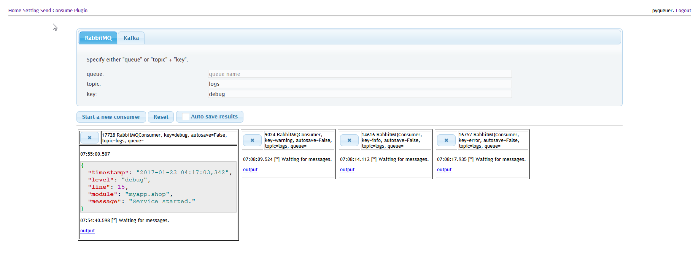
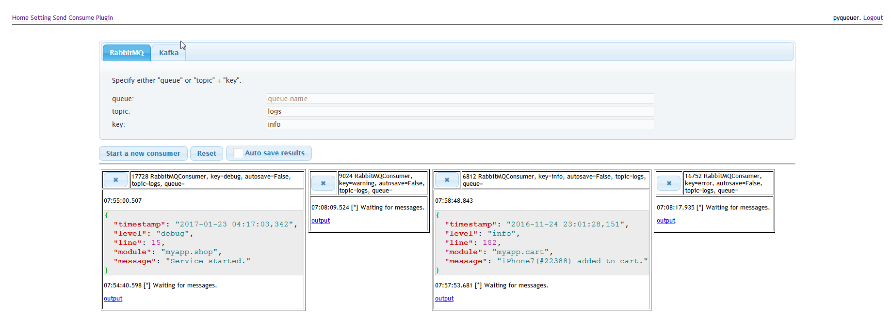
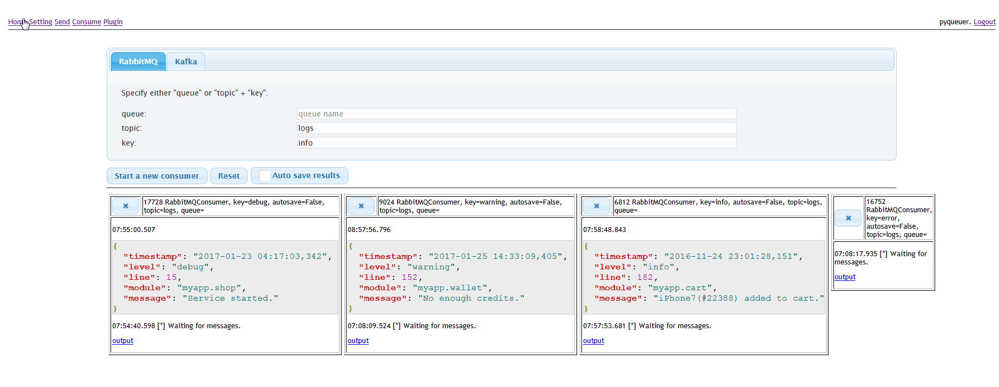
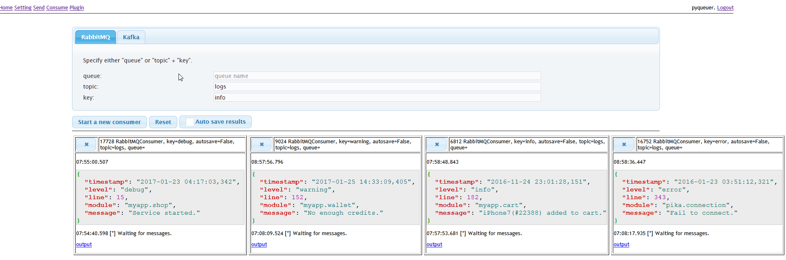

## Use Case 1

This is a very simple case to demo how you leverage PyQueuer to develop one module (logging process service)
in a big system based on MQ. You will never require other modules.

#### Scenario

Says we are building a logging process service in a big system. The logging service will handle all incoming logs.
It makes a log into json and categorize the log with its level.

We have the flow as below:

    Front business logic services
                |
                |--> via queue "logs"
                V
       logging process service
                |
                |--> via topic "logs" and key of levels such as "debug", "error" and etc
                V
    Backend storage service

Says:

- We are using virtual host ``"/myapp"`` on **RabbitMQ**.
- The logging process service name is ``logsvc``.
- The log format is ``"%(levelname)-8s [%(asctime)s] %(name)-30s [%(lineno)d] %(message)s"``.

Check ``docs/case1/logsvc.py`` for the demo app code.

#### Test Data:

Simply provide 4 log entries for each level from "debug" to "error"

	DEBUG    [2017-01-23 04:17:03,342] myapp.shop                     [15] Service started.

	INFO     [2016-11-24 23:01:28,151] myapp.cart                     [182] iPhone7(#22388) added to cart.

	WARNING  [2017-01-25 14:33:09,405] myapp.wallet                   [152] No enough credits.

	ERROR    [2016-01-23 03:51:12,321] pika.connection                [343] Fail to connect.

#### Case Usage

1. Change your folder to ``docs/case1/``.
2. Modify ``case1.ini`` to configure the RabbitMQ configuration.
3. start logging service.

		# python logsvc.py
	
	
4. Browse your PyQueuer page ``http://localhost:8000``. (Says you started it on localhost:8000). Register and login.
5. Navigate to ``/setting`` page and fill some settings.
	
6. Start a new browser/tab for ``/consume`` page.
7. Start 4 consumers for each level (debug, info, warning, error).
	1. Leave **"logs"** no change in _"topic"_ field. Fill **"debug"** in _"key"_ field for _"RabbitMQ"_ tab. Then click _"Start a new consumer"_ button. Do these for all other levels as below.
	2. Fill **"info"** in "key" field for "RabbitMQ" tab. Then click "Start a new consumer" button.
	3. Fill **"warning"** in "key" field for "RabbitMQ* tab. Then click "Start a new consumer" button.
	4. Fill **"error"** in "key" field for "RabbitMQ" tab. Then click "Start a new consumer" button.
	
8. Start a new browser/tab for ``/plugin`` page.
9. Add a stack _"case1-logsvc"_ for this app and save it.
	
10. Start a new browser/tab for ``/send`` page.
11. Switch to _"Data"_ tab for message source. Switch to _"RabbitMQ"_ tab for MQ. Switch to _"case1-logsvc"_ tab for plugin stack. 
12. Paste the "debug" log message from [Test Data](#test-data) to it and send.
	
13. Check your app running console. You will see the process output.
	
14. Check your browser ``"/send"`` tab. You will see the processed message was received.
	
15. Repeat send the other 3 entries in [Test Data](#test-data). Check console output and ``/consume/``.
	
	
	
16. You may also store 4 files for message in ``data_store`` folder to select in _"File"_ tab for sending.

This case is too simple to replace by some simple command/script in console. In next cases, we could use it in more complex scenario.

--End--

